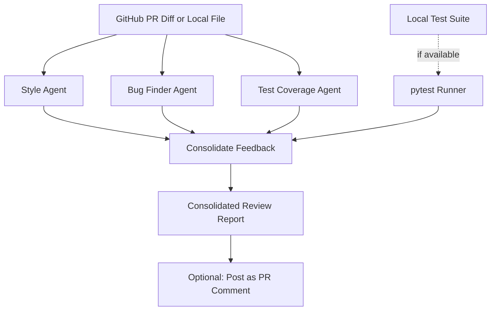

# Autonomous Multi-Agent Code Reviewer

A multi-agent code review system where three specialized agents — a style checker, a bug
finder, and a test-coverage assessor — independently review a code change, and their findings
are consolidated into one review comment. Works against real GitHub PRs or local files.

## Why this project matters

This isn't a single LLM call with a "review this code" prompt — it's genuine **multi-agent
orchestration**: three agents with distinct responsibilities and prompts run in parallel over
the same input, and their outputs are merged by an orchestration layer. That's a real dev-tool
integration pattern, not just a chatbot wrapper, and it's rare to see in a fresher portfolio.

## Features

- 🎨 **Style Agent** — flags naming, formatting, and readability issues
- 🐛 **Bug Finder Agent** — flags logic errors, missing edge-case handling, unhandled exceptions
- ✅ **Test Coverage Agent** — assesses whether a change looks adequately tested
- 🔗 **Real GitHub integration** — fetches actual PR diffs via the GitHub API, can post the
  consolidated review back as a PR comment
- 🧪 **Local test runner** — also runs your actual pytest suite (not just LLM guessing) when
  reviewing a local checkout
- 🌐 **FastAPI endpoint** — trigger reviews via HTTP, e.g. from a CI webhook
- 🖥️ **No-setup CLI demo** — review a sample buggy file in one command, no GitHub token needed
- 🛡️ **Graceful degradation** — every agent falls back to a clear message instead of crashing
  if the LLM call fails
- 🐳 Fully Dockerized

## Architecture



## Tech Stack

| Layer | Technology |
|---|---|
| Agent logic | LangChain + Groq Llama 3.1 8B Instant |
| GitHub integration | PyGithub |
| API layer | FastAPI |
| Local test execution | pytest (subprocess) |
| Deployment | Docker |

## Project Structure

```
multi-agent-code-reviewer/
├── src/
│   ├── config.py                    # settings, env vars
│   ├── github_client.py              # fetch PR diffs, post PR comments
│   ├── agents/
│   │   ├── style_agent.py            # style/readability review
│   │   ├── bug_finder_agent.py       # logic/bug review
│   │   └── test_runner_agent.py      # test coverage assessment + local pytest runner
│   ├── orchestrator.py                # runs all agents, consolidates feedback
│   ├── api.py                          # FastAPI endpoints
│   └── demo.py                          # no-setup CLI demo script
├── sample_code/
│   └── buggy_example.py               # sample file with intentional issues, for demoing
├── tests/
│   └── test_orchestrator.py           # unit tests for consolidation + fallback logic
├── screenshots/                        # add screenshots here
├── requirements.txt
├── Dockerfile
├── .env.example
└── .gitignore
```

## Setup

```bash
# 1. Clone the repo
git clone https://github.com/Punithrajkumar602-boop/multi-agent-code-reviewer.git
cd multi-agent-code-reviewer

# 2. Create virtual environment (Python 3.11 recommended)
py -3.11 -m venv venv
venv\Scripts\activate        # Windows
# source venv/bin/activate   # Mac/Linux

# 3. Install dependencies
pip install -r requirements.txt

# 4. Add your API keys
copy .env.example .env
# GROQ_API_KEY is required (get one free at console.groq.com/keys)
# GITHUB_TOKEN is optional -- only needed for private repos, higher rate
# limits, or posting comments back to a PR
```

## Quick Demo (no GitHub needed)

```bash
py -m src.demo
```

This reviews the included `sample_code/buggy_example.py` (which has intentional style, bug,
and test-coverage issues) and prints a full consolidated review to your terminal.

## Review a Real GitHub PR

```bash
py -m uvicorn src.api:app --reload
```

Then send a request (e.g. via curl, Postman, or the FastAPI docs at `http://localhost:8000/docs`):

```bash
curl -X POST http://localhost:8000/review/pr \
  -H "Content-Type: application/json" \
  -d '{"repo_full_name": "octocat/Hello-World", "pr_number": 1, "post_comment": false}'
```

## Run with Docker

```bash
docker build -t multi-agent-code-reviewer .
docker run -p 8000:8000 --env-file .env multi-agent-code-reviewer
```

Then open **http://localhost:8000/docs** for the interactive API docs.

## Running Tests

```bash
pytest tests/
```

## How It Works

1. Changed files are fetched from a GitHub PR (via PyGithub) or provided directly as local code
2. Each file is sent independently to three agents:
   - **Style Agent** checks naming, formatting, and readability
   - **Bug Finder Agent** checks for logic errors and missing edge-case handling
   - **Test Coverage Agent** assesses whether the change looks tested
3. If a local `tests/` directory exists, the actual pytest suite is run for a real pass/fail result
4. All findings are merged into one consolidated markdown report
5. Optionally, that report is posted back to the PR as a comment (`post_comment: true`)

## Screenshots

*(Add screenshots after your first local run — drag PNGs into `/screenshots` and reference below)*

```


```

## Demo Video

*(Record a 1-2 minute walkthrough: run `py -m src.demo` on the sample buggy file → show the
consolidated review output → optionally show a real PR review via the FastAPI endpoint.
Upload to YouTube (unlisted) or Loom and link it here.)*

`Demo video: [add your link here]`

## Future Improvements

- Add a security-focused agent (checks for hardcoded secrets, SQL injection risk, etc.)
- Add severity-based blocking (auto-request-changes on GitHub if High-severity bugs are found)
- Cache agent results per file hash to avoid re-reviewing unchanged files on PR updates

## Author

**Punith Raj** — AI/ML Engineer
[Portfolio](https://punithraj-ai.netlify.app) | [GitHub](https://github.com/Punithrajkumar602-boop)
